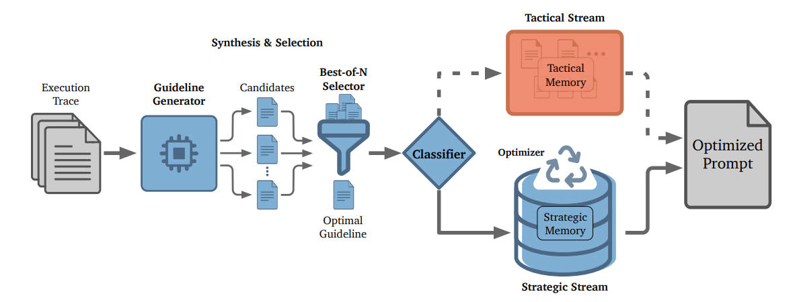

# 介绍
Agent 自进化项目，自进化指的是智能体越用越好，在不微调，不做调整的情况下，通过自身经验的不断优化，实现任务的自动完成，提高任务完成率、准确率等。  

目前分为两种进化模式：
* 离线：使用数据离线提取总结反思经验，把得到的经验再拿去给智能体参考，经验是静止的，在智能体使用时不会改变了，截止目前比较新，开源的 ACE、ReMe 等等。  
* 在线：在智能体边使用边自己提取经验，经验会一直动态变化，开源 ACE、ReMe、SCOPE 等等。  


# 开源项目参考
ACE：[https://github.com/ace-agent/ace](https://github.com/ace-agent/ace)
我验证过是有效果的，代码也全的，使用它提供的数据对比有离线与在线的效果，离线的效果要更好一些。

它是三个组件：
生成器：根据问题生成答案  
反思器：根据问题和答案反思，或没答案根据反馈方式，总结经验  
策展器：根据反思结果，更新经验


SCOPE：[https://github.com/JarvisPei/SCOPE](https://github.com/JarvisPei/SCOPE)
是一个专注在线的进化，边使用智能体，边提取经验的。  

生成指南-选择指南-经验分类-更新经验




# ACE 系统改造
ACE 适合离线，针对它进行了改造  
1. **添加日志功能**：日志记录
2. **专注离线训练**：去除在线依赖，提高系统稳定性
3. **添加 token 消耗统计**：监控训练成本
4. **训练调用次数统计**：每条数据平均调用模型 6-7 次
5. **优化经验处理**：添加去重合并功能，提高经验质量
6. **完善缺失功能**：完善删除、更新、合并操作的功能提示词及代码
7. **大模型**：使用 Langchain
8. **其他**：对代码进行适配修改等


# Agent自进化离线数据集选择
ACE 资深是提供了数据集进行验证的，但我想用其他数据集来验证是否提取经验后真的有效果，找了三个比较适合验证经验提取进化效果的数据集。  
1. **自然语言推理** (ocnli)：需要深度语言理解和推理能力，三分类（蕴含、矛盾、中立）需要细致判断
2. **学术论文专业分类** (专业分类)：涵盖多个学科领域，需要理解专业术语和概念
3. **指代消解** (cluewsc)：需要理解上下文和语义关系，测试指代消解能力

https://github.com/CLUEbenchmark/OCNLI
https://github.com/CLUEbenchmark/CLUE

数据只用来验证没有使用经验 vs 使用经验了的效果对比，不与 benchmark 对比，因为 bert 是专门的精准训练更新参数，自进化是提取经验参考，没有专门调提示词。

# 性能对比
大模型：GLM-4-flash（智谱免费模型）
embedding：text-embedding-v4（阿里云端模型）
展示在相同测试集上有经验，无经验的效果对比。
测试数据都是上千条，提升的点数，大约可以提升好几十条数据的准确。
| 任务 | 训练数据量 | 没经验 | 有经验 | 提升 |
|--------|------------|--------|----------|----------|
| 专业分类 | 669 |39.8% | 42.9% | +3.1% |
| 自然语言推理| 160 | 69.7% | 71.2% | 1.5% |
| 指代消解| 160 | 53.8% | 56.8% | 3% |


# 使用方法
## 环境
包就 langchain 安装，其他缺啥转啥

## 数据准备
ACE 框架提供了有正确答案与无正确答案的两种处理：
1、有正确答案，反思，策展器都会以对其答案为准。
2、无正确答案，反思，策展器以方式环境反馈为准，效果可能不如有正确答案的。
我用的数据都是有答案的。  

训练，验证，测试数据都存储在`/data/process`目录下，可看存放样例，以任务名分类：
```
---/data/process
    ---专业分类
        ---train.json
        ---dev.json
        ---test.json
    ---自然语言推理
        ---train.json
        ---dev.json
        ---test.json
```
训练的话 train.json 一定要存在，dev 可有可无；测试的话 test.json 一定要存在。
数据格式可自行处理，每条数据是第一个 json，只包含两个字段`question`, `target`。

## 模型配置
在根目录有 .env 文件，填入 api
```
# openai model，兼容 openai 的都可以
API_KEY=
BASE_URL=
MODEL=

# 微软 Azure model
AZURE_API_KEY=
AZURE_ENDPOINT=
AZURE_API_VERSION=
AZURE_MODEL=

# embedding model
EMBEDDING_MODEL=
EMBEDDING_API_KEY=
EMBEDDING_BASE_URL=
EMBEDDING_DIMS=1024
```

## 运行 run_offline.py
离线运行的主代码，有以下参数：
| 参数 | 备注 |
|--------|------------|
| task_name | 任务名，与数据目录名下的任务名一致 |
| initial_playbook_path | 经验文件路径，默认为 None |
| mode | 运行模式，offline 离线训练，eval_only 评估数据，根据任务设置 |
| data_processor | data_processor 数据判别器，**必须根据任务定义**，放在 offlin/data_process，类名 DataProcessor，必须有 answer_is_correct，evaluate_accuracy 两个函数 |
| generator_model | 生成器模型 |
| reflector_model | 反思器模型 |
| curator_model | 策展器（经验更新）模型 |
| num_epochs | 训练轮次 |
| max_num_rounds | 每条训练数据最大反思次数 |
| curator_frequency | 策展器每训练几条数据就去更新经验（最好为 1，设计有缺陷） |
| eval_steps | 没训练几条数据就使用 dev 评估 |
| save_steps | 每训练几条数据就保存一次中间得到的经验 |
| max_tokens | 模型最大输出 token |
| test_workers | 验证，测试数据最大并行数 |
| no_ground_truth | 数据有无正确答案 |
| use_bulletpoint_analyzer | 是否开启策展器经验分析，包含去重合并，会用到 embedding，大模型分析 |
| bulletpoint_analyzer_threshold | 经验相似度的阈值，超过这个相似度的经验会被合并 |
| save_path | 结果输出路径 |

## 输出示例

### 离线训练输出目录树
```
offline/results/学术论文专业分类_train/
├── best_playbook.txt                          # 保存训练过程中准确率最高的 playbook，使用这个 playbook 进行测试
├── train_results.json                         # 训练过程记录，包含每个评估点的准确率和样本详情
├── val_results.json                          # 验证集评估结果，包含错误样本的详细信息
├── train_cost_stats.json                      # 训练成本统计，包含 token 消耗和耗时
├── bullet_usage_log.jsonl                     # 经验使用日志，记录每个样本使用的经验点
├── curator_operations_diff.jsonl               # Curator 操作差异日志，记录 playbook 的增删改操作
├── log.log                                    # 全部的日志记录
├── intermediate_playbooks/                    # 中间 playbook 目录，按评估点保存的 playbook 快照
│   ├── epoch_1_step_50_playbook.txt
│   ├── epoch_1_step_100_playbook.txt
│   └── ...
└── detailed_llm_logs/                        # 详细 LLM 调用日志，包含每次模型调用的 token 消耗
    ├── generator_test_eval_0_20260119_173310_472.json
    ├── curator_train_e_1_s_10_20260119_170426_474.json
    └── ...
```

### 测试输出目录树
```
offline/results/学术论文专业分类_playbook/
├── test_test_results.json                     # 测试集评估结果，包含准确率和所有样本的详细信息
├── log.log                                  # 运行日志，记录训练过程中的关键信息
└── run_config.json                         # 运行配置，记录所有参数设置
```


