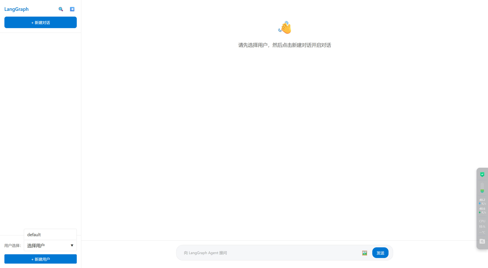
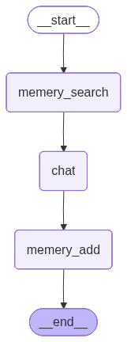

# LangGraph 聊天智能体系统

这是一个基于 LangGraph 框架构建的智能对话系统，支持多用户管理、会话历史记录、图片上传和流式响应等功能。





## 功能特点

### 前端功能
- **多用户管理**：支持创建和切换不同用户身份
- **会话管理**：创建、编辑、删除和切换对话会话
- **实时流式对话**：支持实时流式响应，提供流畅的对话体验
- **图片上传**：支持上传图片并与智能体进行多模态对话
- **历史记录**：保存和查看历史对话记录
- **响应式设计**：适配不同屏幕尺寸的设备

### 后端功能
- **FastAPI 框架**：基于 FastAPI 构建的高性能 API 服务
- **LangGraph 智能体**：使用 LangGraph 框架构建的智能对话代理
- **多模态支持**：支持文本和图片输入的多模态对话
- **会话持久化**：使用 SQLite 数据库存储用户、会话和消息数据
- **流式响应**：支持服务器发送事件(SSE)的流式响应
- **CORS 支持**：配置跨域资源共享，支持前后端分离部署

## 项目结构

```
chat_agent_langgraph/
├── agent/                    # LangGraph 智能体核心代码
│   ├── agent.py             # 智能体主要实现
│   ├── state.py             # 状态管理
│   └── configuration.py     # 配置管理
├── config/                  # 配置文件
│   └── config.yaml          # 应用配置
├── db/                      # 数据库文件
├── frontend/                # 前端代码
│   ├── src/
│   │   ├── App.jsx          # 主应用组件
│   │   └── App.css          # 样式文件
│   ├── public/              # 静态资源
│   └── package.json         # 前端依赖配置
├── model/                   # 本地模型文件
├── start_backend.py         # 后端启动脚本
├── start_frontend.py        # 前端启动脚本
├── run_agent.py             # 智能体独立运行脚本
└── requirements.txt         # Python 依赖
```

## 快速开始

### 环境要求

- Python 3.8+
- Node.js 16+
- npm 或 yarn

### 安装步骤

1. 克隆项目到本地
2. 安装后端依赖：
   ```bash
   pip install -r requirements.txt
   ```

3. 安装前端依赖：
   ```bash
   cd frontend
   npm install
   cd ..
   ```

### 启动方法

#### 方法一：使用启动脚本（推荐）

1. 启动后端服务：
   ```bash
   python start_backend.py
   ```
   后端服务将在 http://localhost:8000 启动

2. 启动前端服务：
   ```bash
   python start_frontend.py
   ```
   前端服务将在 http://localhost:5173 启动，并自动打开浏览器

#### 方法二：手动启动

1. 启动后端：
   ```bash
   uvicorn start_backend:app --reload --host 0.0.0.0 --port 8000
   ```

2. 启动前端：
   ```bash
   cd frontend
   npm run dev
   ```

### 使用方法

1. 打开浏览器访问 http://localhost:5173
2. 点击用户下拉框创建新用户或选择已有用户
3. 点击"新建对话"按钮创建新的对话会话
4. 在输入框中输入问题，可以点击🖼️按钮上传图片
5. 点击"发送"按钮或按 Enter 键发送消息
6. 等待智能体响应，支持实时流式显示

## 技术栈

### 前端
- React 19.2.0
- Vite 7.2.4
- CSS3 (原生样式)

### 后端
- FastAPI
- LangGraph
- SQLite (aiosqlite)
- Pydantic
- Uvicorn

### 智能体
- LangGraph 框架
- GLM 大语言模型
- 多模态支持

## API 接口

后端提供以下主要 API 接口：

- `GET /users` - 获取所有用户
- `POST /users` - 创建新用户
- `GET /sessions/{user_id}` - 获取用户的所有会话
- `POST /sessions` - 创建新会话
- `PUT /sessions/{session_id}` - 更新会话标题
- `DELETE /sessions/{session_id}` - 删除会话
- `GET /sessions/{session_id}/messages` - 获取会话的历史消息
- `POST /chat` - 与智能体对话（支持流式响应）

## 配置说明

配置文件位于 `config/config.yaml`，包含以下配置项：

- 应用信息配置
- CORS 设置
- 数据库路径
- GLM API 密钥
- 系统提示词

## 注意事项

1. 确保 GLM API 密钥已正确配置在 `config/config.yaml` 中
2. 首次运行时会自动创建 SQLite 数据库
3. 图片上传功能支持常见图片格式（jpg, png, gif 等）
4. 流式响应在较慢的网络环境下可能会有延迟

## 开发说明

### 智能体单独运行

如需单独测试智能体功能，可运行：

```bash
python run_agent.py
```

### 自定义配置

可以通过修改 `config/config.yaml` 文件来自定义应用配置，包括：
- 服务器端口
- 数据库路径
- API 密钥
- 系统提示词

## 许可证

本项目采用 MIT 许可证。