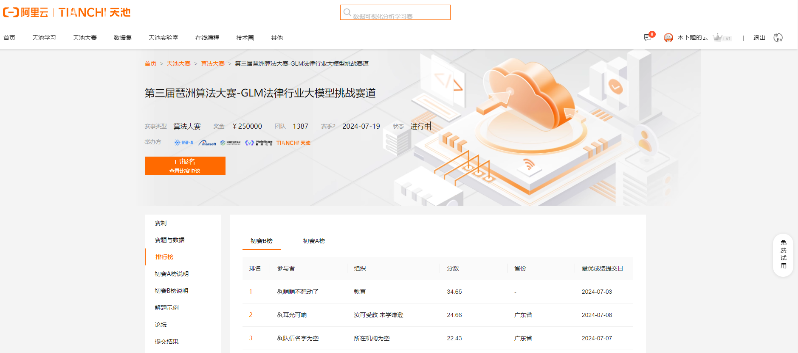
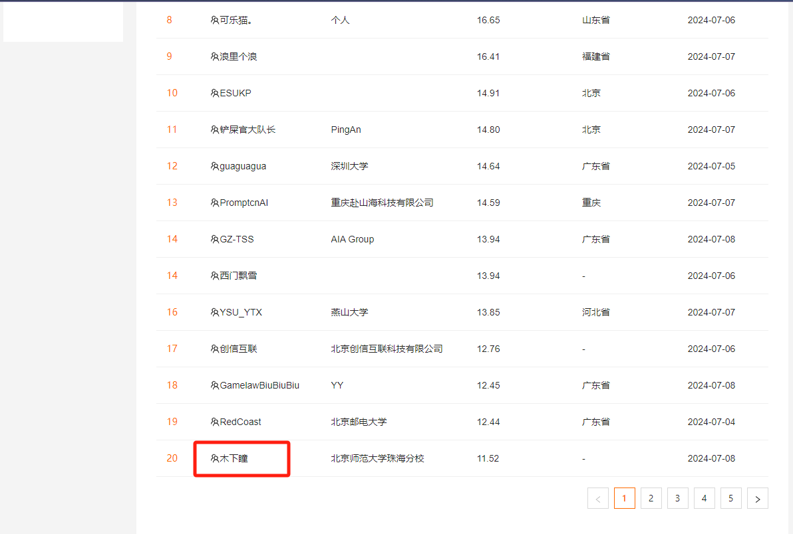

# 项目介绍
项目来自阿里天池，GLM 法律行业大模型挑战赛。
https://tianchi.aliyun.com/competition/entrance/532221/rankingList

给一些问题，以及一些查询数据的api接口，灵活调用api接口，回答问题。

分了 A，B 两个赛段，我只参加了 B 赛段。

A 的题目相对简单一些，接口使用比较少。

B 的就增多好多，接口也复杂一些。

博主不才，整了下，也调整了多次，目前最好的成绩是 20 名，还有很多大佬没提交。

GLM法律行业大模型挑战赛圆满收官🎉🎉🎉，以下是入围9个团队的决赛答辩现场，大家可以一起观摩学习讨论～
https://www.bilibili.com/video/BV13YxFerE8s

# 技术栈
这个比赛提供了api，，以及目的是回答问题，回答的问题须要结合数据，那这个
就是 agent 的应用了。

使用 langchain 框架搭建 agent。

大模型使用 GLM-4 模型。

# 思路
这里就写关键的点
1、定义工具，工具的定义十分重要，接受参数的格式，描述会很影响调用。
2、对问题进行分类，判断需要哪些工具。
3、定义 agent，使用哪个 agent 也会有一些影响，还有 agent 的 prompt 也会影响工具选择，工具调用顺序。
4、执行 agent 生成答案

# 代码主接口
answer.py 就是运行接口，通过读这个代码就能理解整个执行顺序了。
模型 api 在 llm 文件下的 glm_llm.py 中的 ZHIPUAI_API_KEY。
