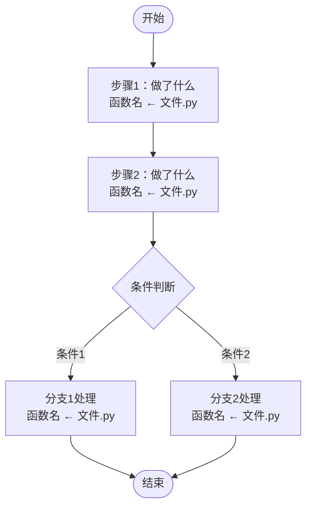

# 【项目名称】项目梳理

## 1. 项目一句话定位

【用一句话概括项目用途，说明这个仓库是干什么的】

## 2. 这个代码仓解决什么问题

### 2.1 主要痛点

【列出 2-5 个核心痛点，说明目标用户面临的问题】

1. **痛点1**：描述
2. **痛点2**：描述
3. ...

### 2.2 项目的处理思路

【整体大概流程，让人读了能知道项目做了什么、怎么解决问题的。可以用文字 + 简要流程图展示】

## 3. 技术架构

### 3.1 总体架构

【项目目录结构树，标注关键目录和文件的用途】

```text
项目名/
├── 目录1/          # 说明
│   ├── 文件1       # 说明
│   └── ...
├── 目录2/          # 说明
└── ...
```

### 3.2 后端技术栈

| 类别 | 技术/依赖 | 作用 |
|---|---|---|
| Web 框架 | xxx | 说明 |
| ... | ... | ... |

### 3.3 前端技术栈（如有）

| 类别 | 技术/依赖 | 作用 |
|---|---|---|
| 框架 | xxx | 说明 |
| ... | ... | ... |

### 3.4 后端入口与路由注册

【说明入口文件位置，注册了哪些路由，路由前缀是什么】

### 3.5 怎么启动服务

#### 3.5.1 一键启动（如有）

【项目是否有一键启动脚本，说明使用方式】

#### 3.5.2 后端启动

【说明虚拟环境创建、依赖安装、命令行启动方式】

```bash
# 示例
cd backend/
python -m venv .venv
.venv\Scripts\activate
pip install -r requirements.txt
python main.py
```

#### 3.5.3 前端启动（如有）

```bash
# 示例
cd frontend/
npm install
npm run dev
```

【如有代理配置，说明前端如何转发 API 请求到后端】

#### 3.5.4 VS Code 调试配置

【说明如何配置 .vscode/launch.json 进行后端调试，如果可以直接给出配置示例】

### 3.6 配置项

【说明配置文件位置和加载方式（如 .env、config.py 等）】

#### 3.6.1 LLM 配置（如涉及大模型）

| 配置项 | 默认值 | 作用 |
|---|---|---|
| `LLM_BASE_URL` | xxx | 模型服务地址 |
| `LLM_API_KEY` | xxx | API Key |
| `LLM_MODEL` | xxx | 模型名称 |
| ... | ... | ... |

#### 3.6.2 服务配置

| 配置项 | 默认值 | 作用 |
|---|---|---|
| `HOST` | xxx | 监听地址 |
| `PORT` | xxx | 监听端口 |
| ... | ... | ... |

#### 3.6.3 其他配置

【根据项目实际情况列出其他关键配置项，如存储路径、超时设置、阈值等】

---

## 4. 【功能模块1名称】

【每个功能模块一个大章节。功能模块是项目中一个完整的业务功能，通常包含多个相关功能点。用简短文字说明这个功能模块做什么】

### 4.1 【功能点1名称】

【子章节用**功能描述**命名，让人一眼看出这个功能点做什么（如"创建会话"、"查询历史消息"、"生成对话回复"），不要用 HTTP 方法和路径命名】

【用 1-2 句话总结这个功能点做了什么】

**流程图**（对标代码细节，便于定位源码）：

```text
功能点名称 → 函数名()              ← 路径/文件.py
  ├→ 步骤1：做了什么（调用哪个函数，在哪个文件）
  ├→ 步骤2：做了什么
  │    └→ 子步骤（调用哪个函数 ← 路径/文件.py）
  ├→ 条件分支1：做了什么
  │    └→ 调用哪个函数 ← 路径/文件.py
  └→ 条件分支2：做了什么
       └→ 调用哪个函数 ← 路径/文件.py
```

**流程可视化**（mermaid 流程图，直观展现业务流转）：



**补充说明**：

- 【关键细节1】
- 【关键细节2】

### 4.2 【功能点2名称】

【同上结构：文字总结 + text 流程图 + mermaid 流程图 + 补充说明】

### 4.3 数据存储（如涉及）

【如果本功能模块涉及数据存储，在此说明存储架构。包括存储分层、表结构、存储目录等】

#### 4.3.1 存储分层

| 存储 | 技术 | 位置 | 用途 |
|---|---|---|---|
| xxx | SQLite/MySQL/... | 路径 | 说明 |
| ... | ... | ... | ... |

#### 4.3.2 表结构

【列出本模块涉及的核心表结构，包括字段名、类型、说明】

#### 4.3.3 存储目录结构

【说明本模块文件存储的目录组织方式】

### 4.4 记忆/会话机制（如涉及）

【如果本功能模块涉及记忆或会话机制，在此详细说明】

#### 4.4.1 历史消息加载

【说明从哪里加载历史消息、加载多少轮、如何映射角色】

#### 4.4.2 消息保存

【说明消息如何保存、保存哪些字段、metadata 中存了什么】

#### 4.4.3 记忆机制总结

| 维度 | 实现 | 限制 |
|---|---|---|
| 历史轮数 | 最多 N 轮 | 说明 |
| 压缩策略 | 有/无 | 说明 |
| 上下文管理 | 方式 | 说明 |
| ... | ... | ... |

### 4.5 提示词模块（如涉及）

【如果本功能模块涉及提示词，在此说明。列出每个提示词的位置、作用、组装内容和关键变量】

#### 4.5.1 【提示词1名称】

**位置**：`路径/文件.py` → `函数名()`

**作用**：【说明这个提示词让 LLM 做什么，返回什么格式】

**组装内容**：

```text
[system message]
  ├→ 角色设定：{角色描述}
  ├→ 变量1：{variable_name}          ← 变量的内容是什么（如"表前5行数据的JSON"），来源（如"从DuckDB临时表读取"）
  ├→ 变量2：{variable_name}          ← 变量的内容是什么，来源
  ├→ 约束条件：
  │    - 约束1
  │    - 约束2
  ├→ 输出格式：{格式说明或模板}
  └→ 其他：{如有}

[chat_history]（如涉及）              ← 说明历史消息来源和轮数

[user message]
  └→ {用户输入变量}                   ← 说明内容来源
```

**LLM 返回解析**（如涉及）：【说明如何解析 LLM 返回，解析失败时的降级策略】

#### 4.5.2 【提示词2名称】

【同上结构】

**提示词对比**（如有多个提示词）：

| 维度 | 提示词1 | 提示词2 |
|---|---|---|
| 调用方式 | 流式/非流式 | 流式/非流式 |
| 输出格式 | 格式说明 | 格式说明 |
| 是否含历史 | 是/否 | 是/否 |
| 核心目标 | 说明 | 说明 |
| 失败降级 | 降级策略 | 降级策略 |

### 4.6 其他关键机制（如涉及）

【如果本功能模块还涉及其他关键机制（如沙箱执行、缓存策略、工具调用等），在此说明】

---

## 5. 【功能模块2名称】

【同第4章的结构。每个功能模块一个大章节，内部包含功能点子章节（文字总结 + text 流程图 + mermaid 流程图 + 补充说明）和该模块涉及的关键机制子章节】

### 5.1 【功能点1名称】

【同 4.1 结构：文字总结 + text 流程图 + mermaid 流程图 + 补充说明】

### 5.2 【功能点2名称】

【同 4.1 结构】

### 5.3 数据存储（如涉及）

【如果本功能模块也涉及数据存储，同样在此说明。不同功能模块可能共享同一存储，也可能各自独立，按实际情况描述】

### 5.4 记忆/会话机制（如涉及）

【如果本功能模块也涉及记忆机制，同样在此说明】

### 5.5 提示词模块（如涉及）

【如果本功能模块也涉及提示词，同样按 4.5 的结构说明：位置、作用、组装内容（变量树状图）、LLM 返回解析、提示词对比】

### 5.6 其他关键机制（如涉及）

【同 4.6】

---

## N. 接口文档

【本章汇总项目所有后端接口，按业界接口文档规范编写。每个接口一个小节，**章节标题用功能名**（如"创建会话"、"查询历史消息"），让人一眼看懂接口用途，**不要用 HTTP 方法和路径**作为标题。请求方法、路径等技术信息在正文中说明。】

【接口排序建议：同一功能模块的接口放在一起，按业务流程顺序排列。可在每个接口小节顶部标注所属功能模块，便于交叉查阅。】

### N.1 【接口功能名1】

**所属模块**：功能模块名称
**请求方法**：`POST`
**请求路径**：`/api/xxx`
**入口文件**：`路径/文件.py` → `函数名()`

**功能说明**：

【1-2 句话说明这个接口做什么】

**请求参数**：

| 字段 | 类型 | 必填 | 说明 |
|---|---|---|---|
| `field1` | str | 是 | 说明 |
| `field2` | int | 否 | 说明 |
| ... | ... | ... | ... |

**请求示例**：

```json
{
  "field1": "value1",
  "field2": 123
}
```

**返回结果**：

| 字段 | 类型 | 说明 |
|---|---|---|
| `code` | int | 状态码 |
| `message` | str | 状态描述 |
| `data.field1` | str | 说明 |
| ... | ... | ... |

**返回示例**：

```json
{
  "code": 0,
  "message": "success",
  "data": {
    "field1": "value1"
  }
}
```

**补充说明**：

- 【边界条件、异常情况、注意事项等】

### N.2 【接口功能名2】

【同上结构：所属模块 + 请求方法 + 请求路径 + 入口文件 + 功能说明 + 请求参数 + 请求示例 + 返回结果 + 返回示例 + 补充说明】

### N.3 【接口功能名3】

【同上结构】

---

## 模板使用说明

### 章节组织原则

1. **第1-3章**：固定结构，所有项目都必须包含。项目定位、解决问题、技术架构。
2. **第4章起至倒数第二章**：按**功能模块**组织，每个功能模块一个大章节。
3. **最后章节（接口文档）**：汇总项目所有后端接口，按业界接口文档规范编写。

### 功能模块章节结构

功能模块章节聚焦于**流程理解**，不包含接口的入参/返回值细节（这些统一放到最后的接口文档章节）。

功能模块内部结构：

- 先按**功能点**分子章节，每个功能点包含：文字总结 + text 流程图 + mermaid 流程图 + 补充说明
- 功能点之后，列出本功能模块涉及的**关键机制**（数据存储、记忆/会话机制、提示词设计等）作为子章节
- 关键机制归属到使用它的功能模块下，不单独成顶级章节
- 如果多个功能模块都涉及同一关键机制（如都用了同一数据库），各自在自己的章节下说明，侧重描述本模块如何使用

功能模块章节结构示例：

```text
## N. 功能模块名称
  ### N.1 功能点1（文字总结 + text 流程图 + mermaid 流程图 + 补充说明）
  ### N.2 功能点2
  ### N.3 数据存储（如涉及）
  ### N.4 记忆/会话机制（如涉及）
  ### N.5 提示词模块（如涉及）
  ### N.6 其他关键机制（如涉及）
```

### 功能点子章节编写规范

- **子章节命名**：用**功能描述**命名（如"创建会话"、"查询历史消息"），让人一眼看出功能点做什么，不要用 HTTP 方法和路径
- **文字总结**：1-2 句话说明这个功能点做什么
- **text 流程图**：标注每一步调用的函数和所在文件，对标原始代码细节，便于读者定位源码
- **mermaid 流程图**：使用 `flowchart TD` 类型，直观可视化展现业务流转，节点标注关键动作和函数/文件位置
- **补充说明**：关键细节、边界条件、注意事项
- **不包含**：入参/返回值字段表格（统一放到接口文档章节）

### text 流程图编写规范

```text
功能点名称 → 函数名()              ← 路径/文件.py
  ├→ 步骤1：做了什么（调用哪个函数，在哪个文件）
  ├→ 步骤2：做了什么
  │    └→ 子步骤（调用哪个函数 ← 路径/文件.py）
  ├→ 条件分支1：做了什么
  │    └→ 调用哪个函数 ← 路径/文件.py
  └→ 条件分支2：做了什么
       └→ 调用哪个函数 ← 路径/文件.py
```

- 每个节点标注：做了什么 + 调用的函数名 + 所在文件路径
- 条件分支用文字说明判断条件
- 深度对标原始代码，让读者能直接定位到对应代码行
- 简单功能点可以简化流程图，不必强行拆分过多步骤

### mermaid 流程图编写规范


- 使用 `flowchart TD`（从上到下）作为默认方向；流程横向时可用 `flowchart LR`
- 节点形状约定：`([开始/结束])` 圆角表示起止，`[步骤]` 矩形表示处理步骤，`{条件}` 菱形表示判断
- 节点内容标注关键动作，可用 `<br/>` 换行后附上函数名和文件位置
- 条件分支的边用 `-- 条件描述 -->` 标注判断条件
- 与 text 流程图互补：text 流程图对标代码细节（便于定位源码），mermaid 流程图展现业务流转（便于直观理解）
- 简单线性流程可省略 mermaid 图，仅保留 text 流程图

### 接口文档章节编写规范

接口文档作为**最后一个章节**，汇总项目所有后端接口，按业界接口文档规范编写：

- **章节标题**：用**功能名**命名（如"创建会话"），不要用 `POST /api/xxx` 作为标题，让人一眼看懂接口用途
- **接口排序**：同一功能模块的接口放在一起，按业务流程顺序排列
- **每个接口小节包含**：
  - 所属模块（标注属于哪个功能模块，便于交叉查阅）
  - 请求方法（GET/POST/PUT/DELETE 等）
  - 请求路径
  - 入口文件（路径/文件.py → 函数名）
  - 功能说明（1-2 句话）
  - 请求参数（字段表格：字段名、类型、是否必填、说明）
  - 请求示例（JSON 示例）
  - 返回结果（字段表格：字段名、类型、说明）
  - 返回示例（JSON 示例）
  - 补充说明（边界条件、异常情况、注意事项）
- **简单接口**：如果请求参数或返回结果很简单，可以省略示例，仅保留字段表格
- **无后端接口的项目**：如果项目没有后端接口（如纯前端项目、纯脚本工具），可省略此章节

### 关键机制归属规则

关键机制（数据存储、记忆/会话、提示词等）**归属到使用它的功能模块下**，不单独成顶级章节：

- 每个功能模块下，功能点子章节之后，列出本模块涉及的关键机制子章节
- 如果多个功能模块都涉及同一关键机制，各自在自己的章节下说明
- 说明时侧重描述**本模块如何使用**该机制，而非重复全局描述
- 如果某个关键机制是全局共享的（如所有模块共用一个数据库），可以在第一个使用它的功能模块下详细说明，后续模块下简要引用

### 灵活调整

- 模板是参考框架而非强制约束，根据项目实际情况调整章节结构
- 简单项目可简化章节，复杂项目可扩展
- 【】占位符为填写指引，最终输出应替换为实际内容
- 不涉及的关键机制子章节直接删除，不要保留空章节
- 无后端接口的项目可省略接口文档章节
