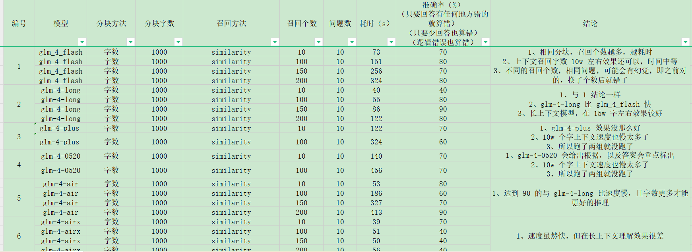
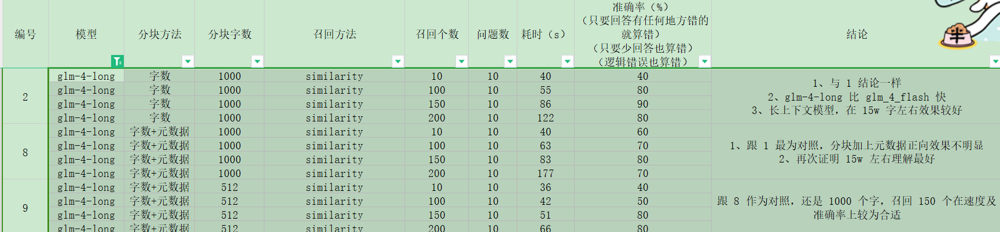
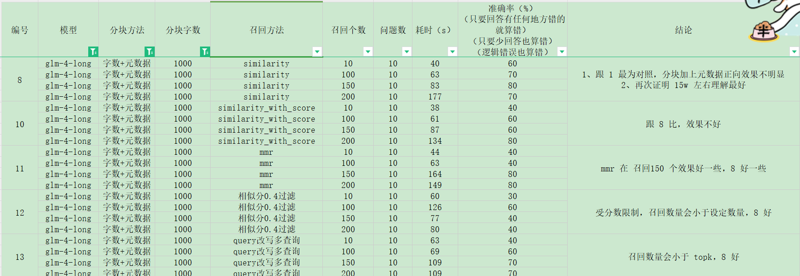
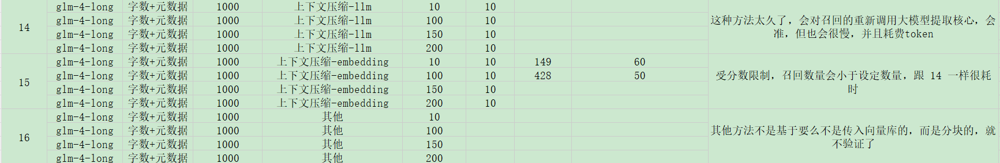

# 项目介绍
《斗破苍穹》小说 RAG 问答，爬虫爬取整部小说章节，并分别保存到不同的数据源中。
txt，pdf，markdown，word。

对数据进行分块，召回，根据问题生成回答。

对比了智谱 GLM 系列所有模型，以及不同召回块数（字数）的效果。

# 模型对比实验
spider.py 为爬虫代码

先用前 100 章节测试，再测试全部章节。
设置 10 个问题，控制变量法
测试结果如下：

对比结果写在了 J 列，总结：

1. glm_4_flash，glm-4-long 两个模型在效果上比较好，时间可以接受，准确率相对较好。
2. glm-4-long 选择了这个模型去继续用。在 15w 字这个模型理解还是比较好的。

# 分块方法对比

1. 字数分块，512, 1000，在 7-15w 字效果差不多
2. 字数分块对比字数分块带上元数据的，效果也差不多，可能相差 1 个左右的准确率
3. 并且别人有验证的带上元数据有好处的，所有后面都带上了

# 检索方法对比

1. 较好的方法是相似性检索，及 mmr 但这两个对比在这里是一样，所以就用了相似性 similary
2. 其他是 langchain 中的其他方法
3. 上面的结论说了再 15w 左右是可以得到答案，且速度还可以，理解也不错，但 15w 还是太多了
，所以先检索 150 个快，15w 字，在从 15w 在检索 50w ，这样更准确，却耗费 token 更少。

# 结果
上面的实验都是在选择，所以最终选择组合为：
1. 字数分块+元数据，分块字数 1000
2. glm-4-long 模型
3. 检索相似性 similary，再混合检索（bm25+相似）得到 50w 字左右上下文参考

## 10条问题
data/test_doc_question.json
在 10 条问题上，使用前 100 章的问题，表现为 80-90%。

在 10 条问题三，使用全部章节，表现为 70-80%。因为内容多了，检索的东西会不一样且受问题影响。

例如：萧炎遇见的神秘老者是谁？

在前 100 章明显是药老，但全文不一定了，神秘老者可能多次出现，如岩浆下的老者等。问得范围太大了。

## 15条问题
data/doc_question.json
80-86.6% 浮动

# 局限性
这个属于常见的 RAG 方法，字数分块，然后检索相关内容，然后生成答案。
但通过这个检索检索会有一下局限性：
1. 具有关联关系的问题是回答不出来的，如问题“萧炎在风雷大会上遇见的迦南学院的熟人是谁？”

检索回来可能是迦南学院有关的人，但不全，不能结合风雷大会去回答。

2. 例如“萧炎老婆是谁？”这小说并没有明确写出‘萧炎的老婆是xxx’这种话，但读者们都知道他老婆的谁

3. 上下文理解少，比如“萧炎晋级斗尊前跟谁打架了？”能找到晋级的那一章，但是跟谁打架了，这是需要前面的剧情的理解的，这并不会检索回来，所以跟问题有关的
上下文不太适合这种 RAG。适合检索某个片段然后回答这个片段的问题。

4. 生成的回答，及检索的内容受问题影响，如上面说的“神秘老者”的问题，问题月具体效果越好。

# 代码
data 是数据文件，运行相关代码生成数据
llm 是大模型调用文件夹
rag 是检索召回，分块等代码
spider.py 爬虫代码
run_embedding_to_vector_all_doc.py 向量化生成整部小说的代码
run_embedding_to_vector_test_doc.py 测试前 100 章向量生成的代码
run_answer.py 回答主流程代码
