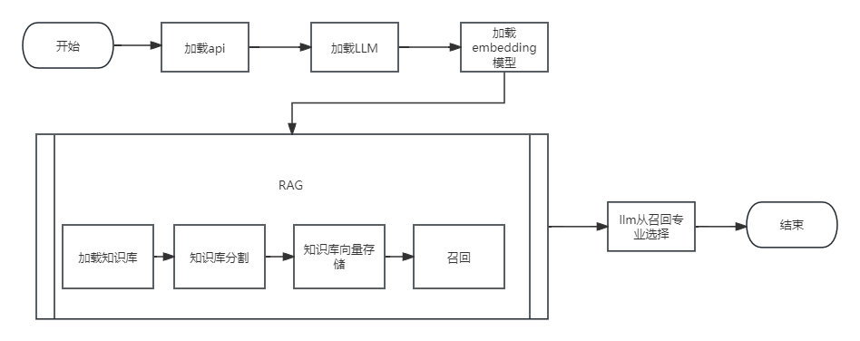
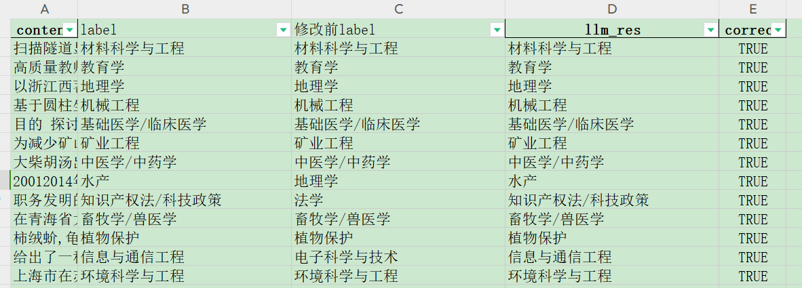
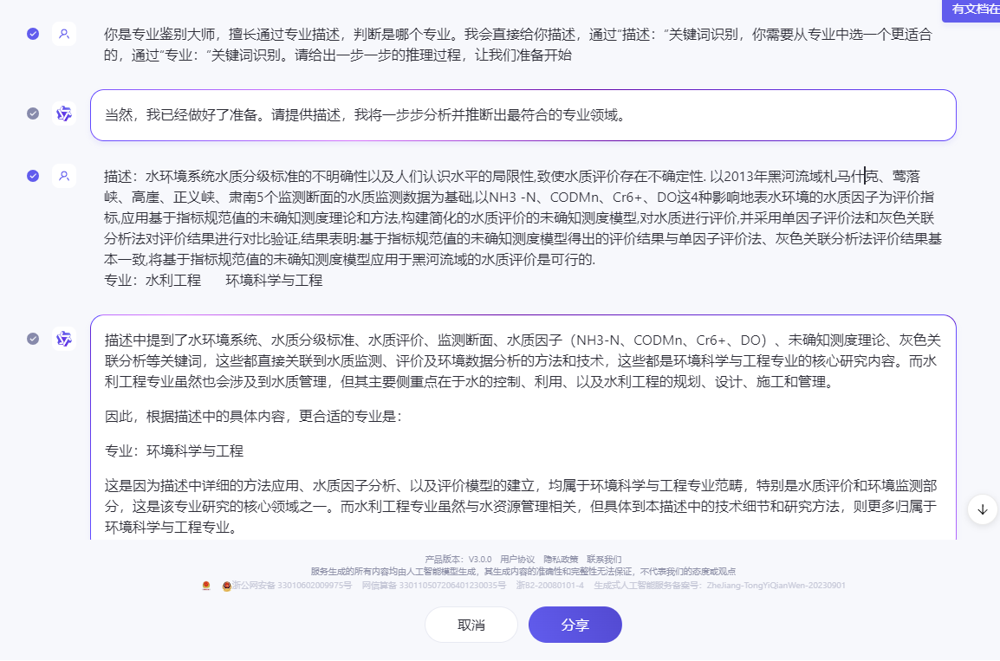

# 项目介绍
本项目利用通义大模型（qwen_plus）对专业描述进行专业分类，或者说打标签。 
通过调用本地 qwen-7b-chat 模型，实现专业描述的的生成。 
使用 langchain 框架，结合 RAG 调用阿里的通义模型，进行专业分类。

# 文件目录
code：存放所有代码 
data：存放数据 
output：输出的结果文件

# 代码入口
main.py 为程序主逻辑，可以运行这个文件即可。 
get_label_info.py 为生成专业描述使用的代码，加载的是本地模型 qwen-7b-chat。 
qwen_main_7B.py 为使用本地 qwen-7b-chat 去预测的代码。

# 代码逻辑流程图

# 数据评测说明
调试 prompt 使用前 100 条数据，评测结果如下： 

|             | 准确率  |
| ----------- |------|
| 没有使用 RAG  | 0.49 |
| 使用 RAG     | 0.59 |

问题分析，分析预测错误数据，看看是标注的不合理，还是真的大模型预测错误： 
人工重新标注一列，如果标注答案不合理，则修改为正确答案，如果答案正确，则保留。 

人工重新标注数据，利用大模型标注： 

详细链接可参考：https://tongyi.aliyun.com/qianwen/share?shareId=aced6d1a-2734-4566-9d33-411ca561d81a

label 修改为合理的后，结果评测： 

|     | 准确率  |
|-----|------|
| 修改前 | 0.59 |
| 修改后 | 0.88 |

# 总结
利用大模型做文本分类，打标签的任务，评测结果好不好，标注的数据也是十分重要的，因为是文本类数据，每个标注的人多多少少有一些误差，所以，需要结合模型结果进行调整。
