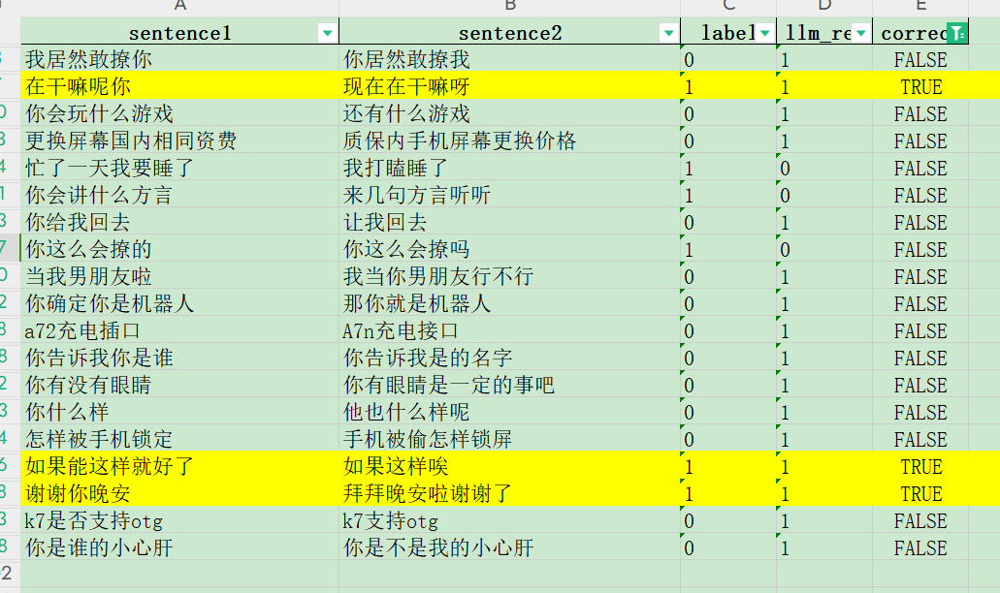

# 项目介绍
本项目利用通义大模型对句子进行语义相似度检测，并输出结果。
使用 langchain 加载模型，并调用 prompt 链。
使用 langchain 的批次调用技术，加快速度。


# 文件目录
code：存放所有代码<br>
data：存放数据<br>
output：输出的结果文件

# tongyi 系列模型评测结果
调试 prompt 使用前 100 条数据，评测结果如下：<br>
prompt 都是相同的，temperture=1

|               | 准确率  |
|---------------|------|
| qwen-plus     | 81.0 |
| qwen-turbo    | 82.0 |
| qwen-7b-chat  | 63.0 |
| qwen-14b-chat | 81.0 |

除了 7b 比较低，其他的都差不多，那使用 14b 来进行调优。


## 调优
prompt：<br>
```js
**标题：**句子相似度判断

**目的：**判定两个句子，sentence1 和 sentence2，是否传达相同的含义或在本质上相似。

**指导说明：**
- 仔细阅读sentence1和sentence2。
- 你的任务是评估这两个句子是否表达相同的概念或在语义上相近，考虑诸如语义和上下文等因素。
- 如果你认为句子意义相同或非常相似，输出 1。
- 如果句子在意义上存在重大差异，输出 0。
- 确保你的回答是 1 表示相似或 0 表示不相似，不需要提供额外的解释或理由。

**示例格式：**
输入：
```
Sentence1: 她喜欢在月光下跳舞。
Sentence2: 在月光下跳舞是她最爱的消遣。
```
输出：1


输入：
```
Sentence1: 快速的棕色狐狸跳过篱笆。
Sentence2: 缓慢的灰色狗在桥下行走。
```
输出：0


轮到你了：
输入：
```
Sentence1: {sentence1}
Sentence2: {sentence2}
```
```
<br><br>
badcase 分析，只有 3 条是数据标注错误，其他的都是模型预测错误。


**方法：修改 prompt，让模型输出理由，看为什么模型会判断错误，根据它的理由进行优化，编写提示词。：**
根据理由优化后的提示词，准确率达到了 85%，以下是提示词：
```js
**标题：**句子相似度判断

**目的：**判断两句子（sentence1 和 sentence2）的语义相似度，考虑核心含义、语境、以及可能存在的实体型号差异。

**指导说明：**
- 仔细阅读sentence1和sentence2。
- 你的任务是评估这两个句子是否表达相同的概念或在语义上相近，考虑诸如语义和上下文等因素。
- 评估句子是否表达相同或非常接近的核心意义.
- 如果你认为句子意义相同或非常相似，输出 1。
- 如果句子在意义上存在重大差异，输出 0。
- 确保你的回答是 1 表示相似或 0 表示不相似，不需要提供额外的解释或理由。

**注意：**
- 如果两个句子主题不一样，那输出 0，例如：“a72充电插口”与“A7n充电接口”。
- 如果两个句子在对话情境中有相似的意图，那输出 1，例如：“你会讲什么方言”与“来几句方言听听”。
- 主语和宾语位置颠倒，那输出 0，例如：“我居然敢撩你”与“你居然敢撩我”。
- 若一句为疑问句式，另一句为陈述句式，即便内容接近，也视为表达不同意图，输出 0。例如，将“你是谁的小心肝”（疑问语气）与“你是不是我的小心肝”（疑问语气，尽管原说明有误，应同样视为疑问句）的情况，调整理解为对比“你是谁的小心肝”（疑问）与“你是我的小心肝”（陈述），则因语气不同，应输出 0。
- 两个句子即使语义上是相似的，但实际上指向的主体不一致，那应该输出 0，例如：“当我男朋友啦”与“我当你男朋友行不行”，第一句话是以女孩的角度，而第二句话是以男生的角度。

**示例格式：**
输入：
```
Sentence1: 她喜欢在月光下跳舞。
Sentence2: 在月光下跳舞是她最爱的消遣。
```
输出：1


输入：
```
Sentence1: 快速的棕色狐狸跳过篱笆。
Sentence2: 缓慢的灰色狗在桥下行走。
```
输出：0


轮到你了：
输入：
```
Sentence1: {sentence1}
Sentence2: {sentence2}
```
```

**以上是提示词：**<br>

人工排查错误样例，有3条是数据标注错误，修改后，最终准确率 88%。

# 智谱 glm-4 测评
以上优化后的 prompt 在智谱的 glm-4 准确率为 84%