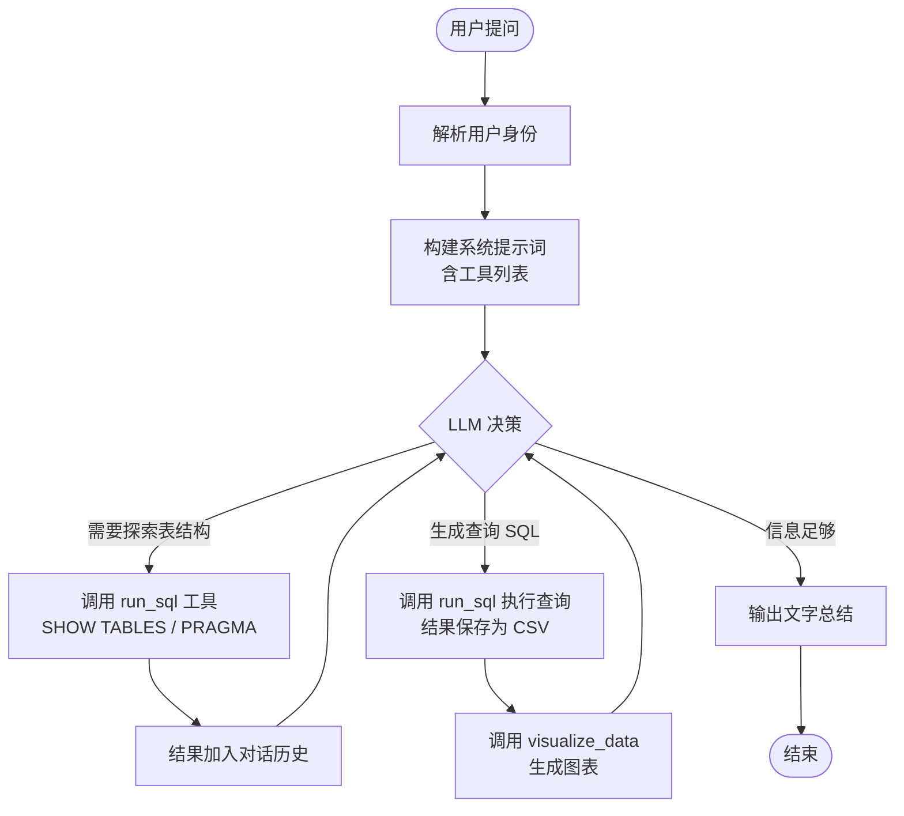
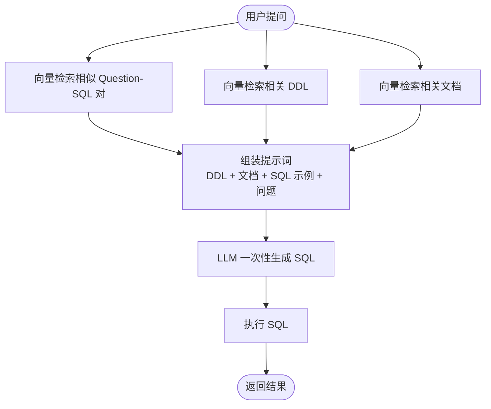
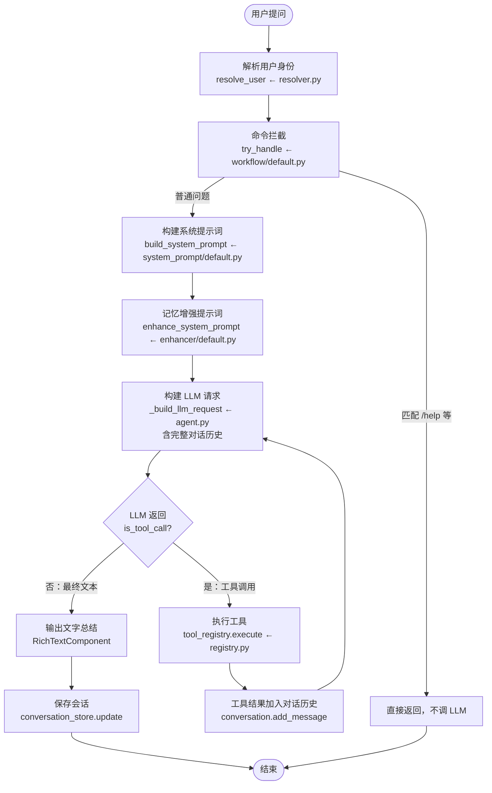
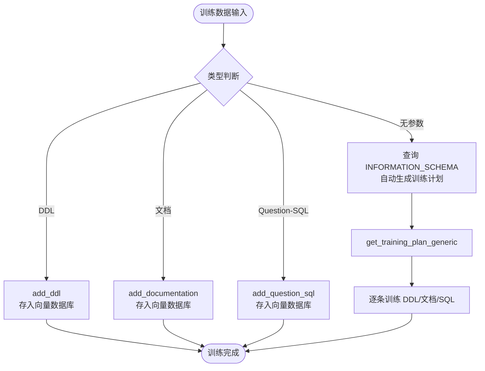
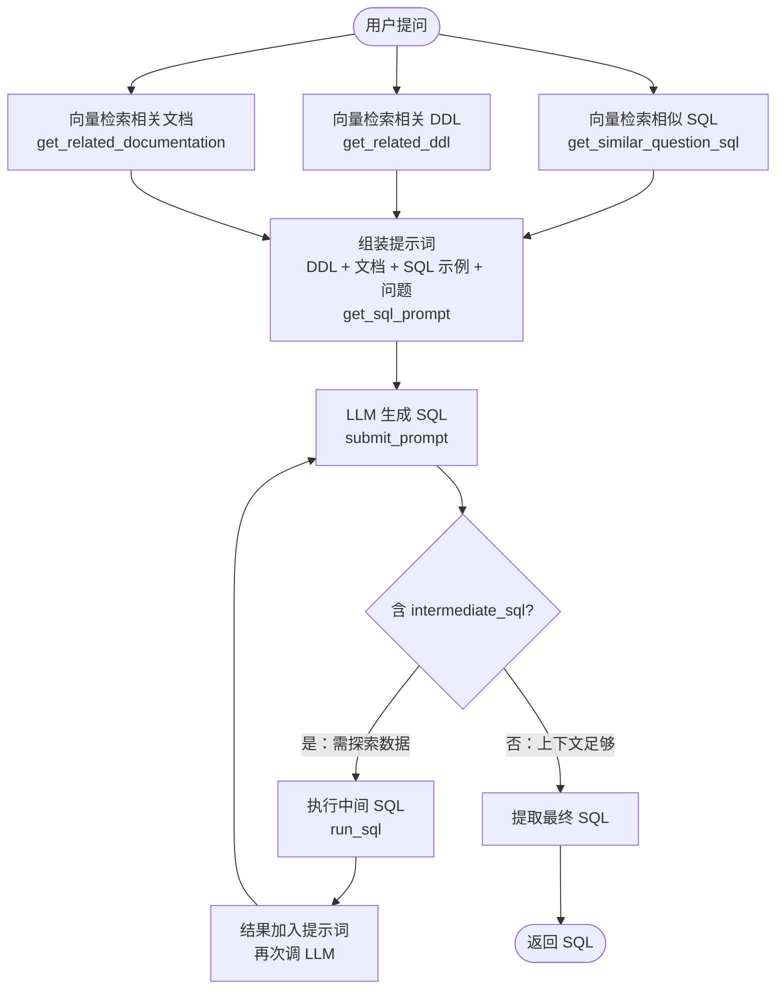

# Vanna 项目梳理

## 1. 项目一句话定位

Vanna 是一个 Text-to-SQL 框架，让用户用自然语言提问，通过 LLM 生成 SQL 查询数据库，返回交互式表格、图表和文字总结。项目同时存在两套架构：2.0 的 ReAct Agent 模式和 0.x 的 RAG 检索模式。

## 2. 这个代码仓解决什么问题

### 2.1 主要痛点

1. **自然语言到 SQL 准确性低**：直接让 ChatGPT 生成 SQL 准确率仅 ~3%，核心原因是 LLM 不知道目标数据库的表结构、字段含义和查询模式。项目论文（`papers/ai-sql-accuracy-2023-08-17.md`）证明，通过提供上下文相关的 DDL + 文档 + SQL 示例，准确率可提升到 ~80%。
2. **企业级权限控制**：多租户环境下不同用户能查询的数据范围不同，需要行级安全和工具访问权限控制。
3. **结果呈现不直观**：纯文本 SQL 结果难以理解，需要表格、图表等富交互组件。

### 2.2 项目的处理思路

项目存在两代架构，解决同一问题的思路完全不同：

**2.0（ReAct Agent 模式）**：让 LLM 作为 Agent，通过工具循环自主探索数据库结构、生成 SQL、执行查询、创建可视化。



**0.x（RAG 检索模式）**：预先训练 DDL/文档/SQL 示例，提问时向量检索相关上下文注入提示词，LLM 一次性生成 SQL。



## 3. 技术架构

### 3.1 总体架构

```text
vanna/
├── src/vanna/
│   ├── core/                       # 核心抽象层
│   │   ├── agent/                  # Agent 编排器 + 配置（2.0 核心）
│   │   │   ├── agent.py            # Agent 类：ReAct 循环主逻辑（1300+ 行）
│   │   │   └── config.py           # AgentConfig、UiFeatures、AuditConfig
│   │   ├── tool/                   # Tool 抽象基类
│   │   ├── llm/                    # LLM 服务抽象
│   │   ├── storage/                # 会话存储抽象
│   │   ├── user/                   # 用户模型 + UserResolver
│   │   ├── system_prompt/          # 系统提示词构建器
│   │   │   └── default.py          # DefaultSystemPromptBuilder
│   │   ├── enhancer/               # LLM 上下文增强器
│   │   │   └── default.py          # DefaultLlmContextEnhancer（用记忆增强提示词）
│   │   ├── workflow/               # 工作流处理器
│   │   │   └── default.py          # DefaultWorkflowHandler
│   │   ├── registry.py             # ToolRegistry（工具注册 + 权限 + 审计）
│   │   ├── lifecycle/              # 生命周期钩子
│   │   ├── middleware/             # LLM 中间件
│   │   └── ...
│   ├── capabilities/               # 能力层抽象（接口）
│   │   ├── agent_memory/           # AgentMemory 接口
│   │   ├── sql_runner/             # SqlRunner 接口
│   │   └── file_system/            # FileSystem 接口
│   ├── tools/                      # 内置工具实现
│   │   ├── run_sql.py              # SQL 查询工具（自动保存 CSV）
│   │   ├── visualize_data.py       # 数据可视化工具
│   │   └── agent_memory.py         # 记忆工具（搜索/保存）
│   ├── integrations/               # 第三方集成实现
│   │   ├── anthropic/              # Anthropic Claude
│   │   ├── openai/                 # OpenAI GPT
│   │   ├── sqlite/                 # SQLite Runner
│   │   ├── duckdb/                 # DuckDB Runner（可查 CSV）
│   │   ├── chromadb/              # ChromaDB 记忆存储
│   │   ├── local/                  # 本地内存实现（DemoAgentMemory）
│   │   ├── plotly/                 # Plotly 图表生成器
│   │   └── ...                     # 更多数据库/LLM/向量存储
│   ├── servers/                    # Web 服务器层
│   │   ├── base/chat_handler.py    # 框架无关的 ChatHandler
│   │   ├── fastapi/               # FastAPI 路由 + 服务器
│   │   ├── flask/                 # Flask 路由 + 服务器
│   │   └── cli/server_runner.py   # CLI 入口
│   ├── legacy/                     # 0.x 兼容层（RAG 模式）
│   │   ├── base/base.py            # VannaBase：DDL 训练 + RAG 检索核心
│   │   ├── adapter.py             # LegacyVannaAdapter：0.x -> 2.0 适配
│   │   └── ...                     # 各 LLM/向量数据库的 0.x 实现
│   └── components/                 # UI 组件库
│       └── rich/                   # 富组件（Card/Chart/DataFrame 等）
├── frontends/webcomponent/         # 前端 <vanna-chat> Web Component
├── tests/
└── pyproject.toml
```

### 3.2 后端技术栈

| 类别 | 技术/依赖 | 作用 |
|---|---|---|
| Web 框架 | FastAPI / Flask | 提供 SSE、WebSocket、Polling 聊天端点 |
| 数据验证 | Pydantic >= 2.0 | 所有模型定义与校验 |
| 数据处理 | pandas | SQL 结果转 DataFrame |
| 可视化 | plotly | 自动图表生成 |
| LLM SDK | anthropic / openai / ollama / google-genai | 多 LLM 支持 |
| 向量存储 | chromadb / pinecone / faiss | 记忆/训练数据的向量检索 |
| SQL 引擎 | sqlite3 / psycopg2 / duckdb 等 | 数据库连接 |
| CLI | click | 命令行工具 |

### 3.3 前端技术栈

| 类别 | 技术/依赖 | 作用 |
|---|---|---|
| 框架 | Lit + TypeScript | Web Component 组件库 |
| 构建 | Vite | 开发与打包 |
| 可视化 | Plotly.js | 前端图表渲染 |

### 3.4 后端入口与路由注册

**CLI 入口**：`src/vanna/servers/cli/server_runner.py`（`vanna` 命令）

**路由注册**：`src/vanna/servers/fastapi/routes.py` -> `register_chat_routes()`

| 方法 | 路径 | 说明 |
|---|---|---|
| GET | `/` | 主聊天界面 HTML |
| POST | `/api/vanna/v2/chat_sse` | SSE 流式聊天（主要端点） |
| WS | `/api/vanna/v2/chat_websocket` | WebSocket 实时聊天 |
| POST | `/api/vanna/v2/chat_poll` | 轮询聊天 |
| GET | `/health` | 健康检查 |

### 3.5 怎么启动服务

#### 3.5.1 CLI 一键启动

```bash
pip install -e ".[fastapi,anthropic]"
vanna --framework fastapi --port 8000 --example claude_sqlite_example
```

#### 3.5.2 代码启动

```python
from vanna import Agent, AgentConfig
from vanna.integrations.anthropic import AnthropicLlmService
from vanna.integrations.sqlite import SqliteRunner
from vanna.integrations.local.agent_memory import DemoAgentMemory
from vanna.tools import RunSqlTool, VisualizeDataTool
from vanna.core.registry import ToolRegistry
from vanna.core.user import UserResolver, User, RequestContext

# 1. 配置数据库（依赖注入）
sql_runner = SqliteRunner(database_path="./Chinook.sqlite")

# 2. 配置工具
tools = ToolRegistry()
tools.register(RunSqlTool(sql_runner=sql_runner))
tools.register(VisualizeDataTool())

# 3. 配置 LLM
llm = AnthropicLlmService(model="claude-sonnet-4-5")

# 4. 配置用户解析器
class MyResolver(UserResolver):
    async def resolve_user(self, ctx: RequestContext) -> User:
        return User(id="alice", group_memberships=["admin"])

# 5. 创建 Agent
agent = Agent(
    llm_service=llm,
    tool_registry=tools,
    user_resolver=MyResolver(),
    agent_memory=DemoAgentMemory(),
    config=AgentConfig(stream_responses=True),
)
```

### 3.6 配置项

Vanna 不使用配置文件，通过环境变量 + 代码构造函数传参。

#### 3.6.1 LLM 配置

| 配置项 | 环境变量 | 默认值 | 作用 |
|---|---|---|---|
| Anthropic API Key | `ANTHROPIC_API_KEY` | 无 | Anthropic 认证 |
| Anthropic 模型 | `ANTHROPIC_MODEL` | `claude-sonnet-4-5` | 使用的模型 |
| OpenAI API Key | `OPENAI_API_KEY` | 无 | OpenAI 认证 |

#### 3.6.2 Agent 配置（AgentConfig）

| 配置项 | 默认值 | 作用 |
|---|---|---|
| `max_tool_iterations` | 10 | ReAct 循环最大轮数 |
| `stream_responses` | True | 是否流式返回 |
| `auto_save_conversations` | True | 是否自动保存会话 |
| `temperature` | 0.7 | LLM 温度 |

#### 3.6.3 数据库配置

通过代码依赖注入，核心是 `SqlRunner` 抽象接口（`src/vanna/capabilities/sql_runner/base.py`）：

| 数据库 | 实现类 | 位置 |
|---|---|---|
| SQLite | `SqliteRunner` | `integrations/sqlite/sql_runner.py` |
| PostgreSQL | `PostgresRunner` | `integrations/postgres/sql_runner.py` |
| MySQL | `MySQLRunner` | `integrations/mysql/sql_runner.py` |
| DuckDB | `DuckDBRunner` | `integrations/duckdb/sql_runner.py` |
| Snowflake | `SnowflakeRunner` | `integrations/snowflake/sql_runner.py` |
| BigQuery | `BigQueryRunner` | `integrations/bigquery/sql_runner.py` |

---

## 4. Text-to-SQL 核心模块（2.0 ReAct 模式）

本模块是 Vanna 2.0 的核心，采用 ReAct（Reasoning + Acting）模式，让 LLM 作为 Agent 通过工具循环自主探索数据库、生成 SQL、执行查询、创建可视化。

### 4.1 用户消息处理（ReAct 主循环）

接收用户自然语言消息，进入 LLM 工具调用循环，LLM 自主决定每一步做什么（探索表结构/生成 SQL/可视化/输出总结），直到 LLM 认为可以回答或达到最大轮数。

```text
用户消息 -> Agent.send_message()              ← core/agent/agent.py
  ├-> resolve_user(request_context)            ← core/user/resolver.py
  ├-> workflow_handler.try_handle()            ← core/workflow/default.py
  │    └-> 匹配 /help、/status 等命令 -> 是则直接返回，跳过 LLM
  ├-> conversation.add_message(role="user")
  ├-> tool_registry.get_schemas(user)          ← core/registry.py（过滤无权限工具）
  ├-> system_prompt_builder.build_system_prompt(user, tools)  ← core/system_prompt/default.py
  ├-> llm_context_enhancer.enhance_system_prompt(prompt, message, user)  ← core/enhancer/default.py
  │    └-> 用 AgentMemory 搜索相关文本记忆，附加到系统提示词末尾
  ├-> _build_llm_request(conversation, tools, user, system_prompt)  ← agent.py
  │    └-> 将 conversation.messages 转为 LlmMessage 列表（含完整对话历史）
  │
  └-> 【ReAct 循环】while tool_iterations < max_tool_iterations:
       ├-> _handle_streaming_response(request) 或 _send_llm_request(request)
       │    └-> llm_service.stream_request(request)  ← integrations/anthropic/llm.py
       ├-> 条件：response.is_tool_call()？
       │    ├-> 是：tool_iterations += 1
       │    │    ├-> conversation.add_message(assistant + tool_calls)
       │    │    ├-> for each tool_call:
       │    │    │    ├-> tool_registry.execute(tool_call, context)  ← core/registry.py
       │    │    │    │    ├-> _validate_tool_permissions(tool, user)
       │    │    │    │    ├-> model_validate(arguments)（Pydantic 校验）
       │    │    │    │    ├-> transform_args(tool, args, user)（可做 RLS）
       │    │    │    │    └-> tool.execute(context, args)
       │    │    │    └-> yield result.ui_component（流式返回前端）
       │    │    ├-> conversation.add_message(role="tool", content=result)
       │    │    └-> _build_llm_request()（重建请求，含工具结果）
       │    └-> 否：conversation.add_message(role="assistant", content)
       │         ├-> yield RichTextComponent(content)（最终文字总结）
       │         └-> break（退出循环）
       │
  └-> conversation_store.update_conversation()（保存会话）
```

**流程可视化**：



**补充说明**：

- ReAct 循环的核心：LLM 每轮看到完整对话历史（之前所有工具调用和结果），自主决定下一步做什么
- LLM **不显式校验 SQL 正确性**：查询报错时错误信息回传，LLM 可能修正重试；查询成功但逻辑错误时，LLM 不一定能发现
- 达到 `max_tool_iterations`（默认 10）时强制退出并返回警告
- 全程贯穿可观测性：每个步骤创建 span、记录 metric

### 4.2 SQL 查询执行（run_sql 工具）

LLM 通过 `run_sql` 工具执行 SQL，工具内部自动将 SELECT 结果保存为 CSV 文件供下游可视化使用。

```text
RunSqlTool.execute(context, args)              ← tools/run_sql.py
  ├-> sql_runner.run_sql(args, context)        ← integrations/sqlite/sql_runner.py
  │    └-> sqlite3.connect() -> cursor.execute(args.sql)
  │         └-> 返回 pd.DataFrame
  ├-> 条件：query_type == "SELECT"？
  │    ├-> 是：
  │    │    ├-> df.to_dict("records")
  │    │    ├-> file_system.write_file("query_results_{uuid}.csv", csv_content)  ← 自动保存 CSV
  │    │    ├-> 截断结果预览（>1000 字符时截断 + 提示 LLM 调用可视化）
  │    │    └-> 返回 DataFrameComponent（前端渲染表格）
  │    └-> 否（INSERT/UPDATE/DELETE）：
  │         └-> 返回 NotificationComponent（影响行数）
  └-> ToolResult(result_for_llm="结果预览...\n**IMPORTANT: FOR VISUALIZE_DATA USE FILENAME: xxx.csv**")
```

**补充说明**：

- CSV 保存是工具内部自动行为，不是 LLM 的独立决策
- 返回给 LLM 的文本中包含文件名提示，引导 LLM 下一步调用 `visualize_data`
- 大结果截断时明确告诉 LLM："不需要总结，下一步应该调用 visualize_data"

### 4.3 数据可视化（visualize_data 工具）

LLM 根据 run_sql 返回的 CSV 文件名，自动调用可视化工具生成 Plotly 图表。

```text
VisualizeDataTool.execute(context, args)       ← tools/visualize_data.py
  ├-> file_system.read_file(args.filename, context)
  ├-> pd.read_csv(csv_content)
  ├-> PlotlyChartGenerator.generate_chart(df, title)  ← integrations/plotly/chart_generator.py
  │    └-> 启发式选择图表类型：
  │         ├-> 4+ 列 -> 表格
  │         ├-> 1 数值列 -> 直方图
  │         ├-> 1 分类 + 1 数值 -> 柱状图
  │         ├-> 2 数值列 -> 散点图
  │         └-> 时间序列 -> 折线图
  └-> 返回 ChartComponent(chart_type="plotly", data=chart_dict)
```

### 4.4 ReAct 可用工具清单

ReAct 循环中 LLM 能使用的工具取决于 `ToolRegistry` 中注册了哪些。以下是项目内置的全部工具：

| 工具名 | 类 | 位置 | 作用 |
|---|---|---|---|
| `run_sql` | `RunSqlTool` | `tools/run_sql.py` | 执行 SQL 查询，结果自动保存为 CSV |
| `visualize_data` | `VisualizeDataTool` | `tools/visualize_data.py` | 读取 CSV 生成 Plotly 图表 |
| `search_saved_correct_tool_uses` | `SearchSavedCorrectToolUsesTool` | `tools/agent_memory.py` | 搜索相似问题的历史工具调用模式 |
| `save_question_tool_args` | `SaveQuestionToolArgsTool` | `tools/agent_memory.py` | 保存成功的"问题-工具-参数"组合 |
| `save_text_memory` | `SaveTextMemoryTool` | `tools/agent_memory.py` | 保存自由文本记忆（如 schema 说明） |
| `list_files` | `ListFilesTool` | `tools/file_system.py` | 列出目录中的文件 |
| `read_file` | `ReadFileTool` | `tools/file_system.py` | 读取文件内容 |
| `write_file` | `WriteFileTool` | `tools/file_system.py` | 写入文件 |
| `edit_file` | `EditFileTool` | `tools/file_system.py` | 编辑文件 |
| `search_files` | `SearchFilesTool` | `tools/file_system.py` | 搜索文件内容 |
| `run_python_file` | `RunPythonFileTool` | `tools/python.py` | 执行 Python 文件 |
| `pip_install` | `PipInstallTool` | `tools/python.py` | 安装 Python 包 |

**典型配置**（以 `claude_sqlite_example` 为例）：

```python
# 只注册 SQL + 可视化 + 记忆工具
tools.register(RunSqlTool(sql_runner=sqlite_runner))     # run_sql
tools.register(VisualizeDataTool())                       # visualize_data
tools.register(SearchSavedCorrectToolUsesTool())          # search_saved_correct_tool_uses
tools.register(SaveQuestionToolArgsTool())                # save_question_tool_args
```

**补充说明**：

- **不是所有工具都会自动注册**。开发者通过 `tools.register()` 按需注册，只有注册的工具才会出现在 LLM 的工具列表中
- 文件系统工具和 Python 工具主要用于 **coding agent** 场景（见 `examples/coding_agent_example.py`），Text-to-SQL 场景通常只注册前 5 个工具
- 工具可通过 `access_groups` 控制权限，如 `save_question_tool_args` 通常限制为 admin only
- 开发者可继承 `Tool[T]` 基类自定义工具，见 `examples/mock_custom_tool.py`

### 4.5 启动 UI 与命令处理

`DefaultWorkflowHandler` 在 LLM 调用前拦截特殊命令，避免命令消耗 LLM token。

```text
DefaultWorkflowHandler.try_handle(agent, user, conversation, message)  ← core/workflow/default.py
  ├-> 匹配 /help -> 返回帮助信息（所有用户可用）
  ├-> 匹配 /status -> 返回工具配置状态报告（仅 admin）
  ├-> 匹配 /memories -> 查看最近记忆（仅 admin）
  ├-> 匹配 /delete {id} -> 删除指定记忆（仅 admin）
  └-> 不匹配 -> should_skip_llm=False，继续走 LLM 流程
```

**补充说明**：

- 空消息触发启动 UI：根据角色（admin/user）返回不同的欢迎卡片，admin 可见工具配置状态和记忆管理入口

### 4.5 记忆/会话机制

#### 4.5.1 对话历史管理（上下文如何传给 LLM）

**关键机制**：ReAct 循环中，每轮工具调用的结果都会作为 `role="tool"` 的消息加入 `conversation.messages`。下一轮请求 LLM 时，**整个对话历史都发过去**，LLM 自然就"记住"了之前查到的表结构。

```text
第 1 轮发给 LLM 的消息：
  [system] "You are Vanna..."
  [user]   "查一下销量前 10 的客户"

  LLM 返回：run_sql("SHOW TABLES")
  -> 结果加入对话：
  [assistant] tool_calls=[run_sql("SHOW TABLES")]
  [tool]      "Customer, Invoice, InvoiceLine, Track..."

第 2 轮发给 LLM 的消息（包含上一轮结果）：
  [system] ...
  [user]   "查一下销量前 10 的客户"
  [assistant] tool_calls=[run_sql("SHOW TABLES")]
  [tool]      "Customer, Invoice, ..."
  
  LLM 返回：run_sql("PRAGMA table_info(Customer)")
  -> 结果加入对话...
```

**补充说明**：

- **无轮数截断**：对话历史全量加载，长对话可能导致 token 超限
- 可通过 `conversation_filters` 扩展点自定义截断策略（默认未实现）
- 可通过 `llm_middlewares` 扩展点实现缓存

#### 4.5.2 Agent 记忆机制（学习成功模式）

Agent 记忆通过 `AgentMemory` 抽象接口实现，用于保存和检索成功的工具使用模式。

> **注意**：2.0 的"语义检索"本质是**记忆检索**--搜索之前成功执行过的"问题-工具-参数"模式，帮助 LLM 复用历史经验。它**不检索表结构、字段信息、DDL**这些数据库语义信息。数据库 schema 的获取完全依赖 LLM 通过 `run_sql("SHOW TABLES")` 等工具自己探索。真正的"SQL 语义检索"（检索相关 DDL/文档/SQL 示例）是 0.x RAG 模式的核心能力，详见第 5 章。

| 工具 | 作用 | 触发时机 |
|---|---|---|
| `search_saved_correct_tool_uses` | 搜索相似问题的历史工具调用模式 | LLM 在执行工具前主动调用（提示词要求） |
| `save_question_tool_args` | 保存"问题-工具-参数"组合 | LLM 在工具成功后主动调用（提示词要求） |
| `save_text_memory` | 保存自由文本记忆（如 schema 说明） | LLM 主动调用 |

**记忆存储实现**：

| 实现 | 位置 | 相似度算法 |
|---|---|---|
| `DemoAgentMemory` | `integrations/local/agent_memory/in_memory.py` | Jaccard + difflib（零依赖） |
| `ChromaAgentMemory` | `integrations/chromadb/agent_memory.py` | 向量嵌入 |
| `PineconeAgentMemory` | `integrations/pinecone/agent_memory.py` | 向量嵌入 |

#### 4.5.3 记忆机制总结

| 维度 | 实现 | 限制 |
|---|---|---|
| 对话历史 | 全量加载，无截断 | 长对话 token 超限风险 |
| 工具模式记忆 | AgentMemory.save_tool_usage() | 需配置记忆工具才生效 |
| 文本记忆 | AgentMemory.save_text_memory() | 通过 DefaultLlmContextEnhancer 注入系统提示词 |
| 相似度搜索 | DemoAgentMemory 用 Jaccard + difflib | 阈值默认 0.7 |
| 记忆容量 | DemoAgentMemory 默认 10000（FIFO） | 向量存储无硬限制 |

### 4.6 提示词设计

#### 4.6.1 系统提示词（DefaultSystemPromptBuilder）

**位置**：`src/vanna/core/system_prompt/default.py` -> `build_system_prompt()`

**作用**：根据可用工具动态构建系统提示词，包含角色设定、响应规范、记忆工作流指令。

**组装内容**：

```text
[system message]
  ├-> 角色设定："You are Vanna, an AI data analyst assistant created to help 
  │              users with data analysis tasks. Today's date is {today_date}."
  ├-> 响应规范：
  │    - 任何总结/观察应作为最后一步
  │    - 使用工具帮助用户达成目标
  │    - 查询结果已展示给用户，无需在响应中重复
  ├-> 工具列表：{', '.join(tool_names)}  ← tool_registry.get_schemas(user)
  │
  ├-> [条件：有 search/save 记忆工具] 工具使用记忆工作流：
  │    ├-> 执行任何工具前 MUST 先调用 search_saved_correct_tool_uses
  │    ├-> 成功后 MUST 调用 save_question_tool_args 保存模式
  │    └-> 工作流示例 + 例外情况说明
  │
  └-> [条件：有 save_text_memory 工具] 文本记忆：
       ├-> 用途：保存 schema 细节、术语、查询模式
       └-> 不应保存：一次性结果、临时观察
```

**LLM 返回解析**：由各 LLM 服务的 `_parse_message_content()` 解析。Anthropic 实现将 `tool_use` 块解析为 `ToolCall`，`text` 块解析为文本。

#### 4.6.2 记忆增强提示词（DefaultLlmContextEnhancer）

**位置**：`src/vanna/core/enhancer/default.py` -> `enhance_system_prompt()`

**作用**：在系统提示词末尾追加从 AgentMemory 搜索到的相关文本记忆。

**组装内容**：

```text
[原系统提示词]

## Relevant Context from Memory

The following domain knowledge and context from prior interactions may be relevant:

• {memory.content}    ← 来自 AgentMemory.search_text_memories(query=user_message, limit=5)
• ...
```

**失败降级**：记忆搜索失败时返回原始提示词，不中断请求。

#### 4.6.3 2.0 提示词的关键问题

**2.0 版本不预先注入 DDL**。这是与 0.x 的本质区别：

- LLM 不知道数据库有哪些表、字段是什么
- LLM 必须通过 `run_sql("SHOW TABLES")` 和 `run_sql("PRAGMA table_info(...)")` 自己探索
- 探索结果留在对话历史中，后续轮次 LLM 能看到
- 如果表很多（如 100 张），LLM 不可能全部探索完，只能猜，准确性有隐患

### 4.7 权限与审计机制

#### 4.7.1 三层权限控制

| 层面 | 机制 | 实现 |
|---|---|---|
| 工具访问 | `tool.access_groups` 与 `user.group_memberships` 取交集 | `ToolRegistry._validate_tool_permissions()` |
| UI 特性 | `UiFeatures` 配置哪些组可见哪些特性 | `AgentConfig.ui_features` |
| 参数转换 | `transform_args()` 可按用户改写工具参数（如 RLS） | `ToolRegistry.transform_args()` |

#### 4.7.2 UI 特性控制

| 特性 | 默认允许组 | 说明 |
|---|---|---|
| `tool_names` | admin, user | 显示工具名称 |
| `tool_arguments` | admin | 显示工具参数 |
| `tool_error` | admin | 显示工具错误详情 |
| `memory_detailed_results` | admin | 显示记忆搜索详细结果 |

---

## 5. 0.x RAG 模式（Legacy Text-to-SQL）

0.x 版本采用完全不同的 RAG 检索模式：预先训练 DDL/文档/SQL 示例，提问时向量检索相关上下文注入提示词，LLM 一次性生成 SQL。此模式保留在 `src/vanna/legacy/` 目录中。

> **核心区别**：0.x 的向量检索是真正的 **SQL 语义检索**--根据用户问题的语义，从知识库中检索相关的表结构（DDL）、字段说明（文档）、相似查询示例（Question-SQL 对），注入到提示词中让 LLM 生成准确的 SQL。这正是论文证明从 ~3% 提升到 ~80% 准确率的关键。而 2.0 的"语义检索"只是记忆检索（复用历史工具调用模式），不涉及数据库 schema 的语义理解。

### 5.1 训练阶段（构建知识库）

将 DDL、文档、SQL 示例存入向量数据库，作为 RAG 检索的知识库。

```text
VannaBase.train(question, sql, ddl, documentation, plan)  ← legacy/base/base.py
  ├-> 条件分支：
  │    ├-> 有 documentation -> add_documentation(doc) -> 存入向量数据库
  │    ├-> 有 sql（+ question）-> add_question_sql(question, sql) -> 存入向量数据库
  │    ├-> 有 ddl -> add_ddl(ddl) -> 存入向量数据库
  │    └-> 有 plan -> 遍历 TrainingPlan 逐条添加
  ├-> 如果只有 sql 没有 question：
  │    └-> generate_question(sql) -> 用 LLM 反推问题 -> 再 add_question_sql()
  └-> 自动训练（无参数调用）：
       ├-> connect_to_xxx() 后，查询 INFORMATION_SCHEMA
       ├-> get_training_plan_generic(df) -> 生成训练计划
       └-> 逐条执行训练
```

**流程可视化**：



**补充说明**：

- 三种训练数据：DDL（表结构）、文档（业务术语说明）、Question-SQL 对（示例查询）
- 训练数据通过 `generate_embedding()` 生成向量嵌入，存入向量数据库
- `get_training_plan_snowflake()` 可自动从 Snowflake 查询历史中提取训练数据

### 5.2 SQL 生成阶段（RAG 检索 + 一次性生成）

提问时向量检索三种相关上下文，组装提示词，LLM 一次性生成 SQL。

```text
VannaBase.generate_sql(question)              ← legacy/base/base.py
  ├-> get_similar_question_sql(question)       -> 向量搜索相似 Question-SQL 对
  ├-> get_related_ddl(question)               -> 向量搜索相关 DDL
  ├-> get_related_documentation(question)      -> 向量搜索相关文档
  ├-> get_sql_prompt(question, question_sql_list, ddl_list, doc_list)
  │    ├-> 角色设定："You are a {dialect} expert."
  │    ├-> add_ddl_to_prompt() -> 拼接 DDL（token 预算内）
  │    ├-> add_documentation_to_prompt() -> 拼接文档
  │    ├-> 拼接 Question-SQL 示例（few-shot）
  │    └-> 拼接响应规范
  ├-> submit_prompt(prompt) -> LLM 生成 SQL
  ├-> 条件：LLM 返回含 "intermediate_sql"？
  │    ├-> 是（需要数据探索）：
  │    │    ├-> extract_sql(llm_response) -> 提取中间 SQL
  │    │    ├-> run_sql(intermediate_sql) -> 执行探索查询
  │    │    ├-> 将结果加入 prompt -> 再次 submit_prompt()
  │    │    └-> 返回最终 SQL
  │    └-> 否：直接返回 SQL
  └-> extract_sql(llm_response) -> 提取 SQL 语句
```

**流程可视化**：



**补充说明**：

- DDL/文档/SQL 示例通过向量检索获取，只注入与问题相关的内容（token 预算内，默认 14000）
- `intermediate_sql` 机制：LLM 可要求先执行探索查询（如查某列的 distinct 值），结果加入上下文后再次生成
- 一次性生成 SQL（上下文足够时），不需要多轮工具调用

### 5.3 0.x 提示词设计

**位置**：`src/vanna/legacy/base/base.py` -> `get_sql_prompt()`

**组装内容**：

```text
[system message]
  ├-> 角色设定："You are a {dialect} expert. Please help to generate a SQL query 
  │              to answer the question."
  ├-> === DDL Statements ===
  │    ├-> {ddl_1}  ← 向量检索的相关 DDL，如 "CREATE TABLE Customer (CustomerId INT, ...)"
  │    └-> {ddl_2}  ← 受 max_tokens（默认 14000）限制
  ├-> === Additional Context ===
  │    ├-> {doc_1}  ← 向量检索的相关文档，如 "Customer 表存储客户信息，Total 是总消费"
  │    └-> {doc_2}
  ├-> === Response Guidelines ===
  │    - 上下文充分时直接生成 SQL
  │    - 需要知道某列值时可生成 intermediate_sql
  │    - 上下文不足时说明原因
  │    - 使用最相关的表
  │    - 确保输出是 {dialect}-compliant
  └-> Question-SQL 示例（few-shot）：
       [user] "What are the top 10 customers?"   ← 检索到的相似 Q-SQL 对
       [assistant] "SELECT ... ORDER BY ... LIMIT 10"

[user message]
  └-> {用户的问题}
```

### 5.4 数据存储

#### 5.4.1 存储分层

| 存储 | 技术 | 位置 | 用途 |
|---|---|---|---|
| 会话存储（2.0） | 内存 Dict | `MemoryConversationStore` | 保存对话历史 |
| 记忆存储（2.0） | 内存/ChromaDB/Pinecone | 各 integrations | 工具使用模式和文本记忆 |
| 训练数据（0.x） | ChromaDB/Pinecone/FAISS 等向量数据库 | 各 legacy 实现 | DDL/文档/SQL 示例 |
| 查询结果文件 | 本地文件系统 | `./{work_dir}/` | CSV 临时文件 |

#### 5.5 LegacyVannaAdapter（0.x -> 2.0 适配器）

`LegacyVannaAdapter`（`src/vanna/legacy/adapter.py`）将 0.x 的 `VannaBase` 实例包装为 2.0 的 `ToolRegistry` + `AgentMemory`，实现两套架构的桥接：

```text
LegacyVannaAdapter(vn)                        ← legacy/adapter.py
  ├-> 实现 ToolRegistry：
  │    ├-> 注册 RunSqlTool -> LegacySqlRunner(vn) 包装 vn.run_sql()
  │    ├-> 注册 SaveQuestionToolArgsTool -> admin only
  │    └-> 注册 SearchSavedCorrectToolUsesTool -> user + admin
  │
  └-> 实现 AgentMemory：
       ├-> save_tool_usage() -> vn.add_question_sql(question, sql)
       ├-> search_similar_usage() -> vn.get_similar_question_sql(question)
       ├-> save_text_memory() -> vn.add_documentation(content)
       └-> search_text_memories() -> vn.get_related_documentation(query)
```

**补充说明**：

- 适配器让 0.x 用户无需重写代码即可使用 2.0 的 Agent 框架和 Web UI
- 但适配器**只桥接工具和记忆**，0.x 的 DDL RAG 注入机制不会自动接入 2.0 的系统提示词

---

## 6. 两代架构对比与优势分析

### 6.1 Text-to-SQL 机制对比

| 维度 | 2.0 ReAct 模式 | 0.x RAG 模式 |
|---|---|---|
| **Schema 来源** | LLM 用 run_sql 工具自己探索（SHOW TABLES / PRAGMA） | 预先训练 DDL，向量检索注入提示词 |
| **SQL 生成方式** | 多轮工具调用，逐步探索后生成 | 一次性生成（上下文足够时） |
| **上下文构建** | 对话历史累积（每轮工具结果留在 messages 中） | 向量检索 DDL + 文档 + SQL 示例 |
| **LLM 调用次数** | 多次（每轮工具调用一次） | 1-2 次（含 intermediate_sql 探索） |
| **Token 消耗** | 高（每轮带完整对话历史） | 低（单次请求，提示词含检索结果） |
| **准确性** | 依赖 LLM 推理和探索能力 | 依赖训练数据质量，论文证明可达 ~80% |
| **大量表场景** | 隐患：LLM 不可能探索所有表 | 优势：向量检索精准找到相关表 DDL |
| **灵活性** | 高：LLM 可动态探索未知数据库 | 低：必须预先训练才能工作 |
| **响应速度** | 慢：多轮 LLM 调用 | 快：1-2 次 LLM 调用 |

### 6.2 各自的优势

**2.0 ReAct 模式优势**：

- **零配置启动**：不需要预先训练 DDL，连接数据库即可开始查询
- **动态探索**：LLM 能处理之前没见过的数据库结构
- **多步骤推理**：能处理复杂分析任务（查表 -> 查字段 -> 生成 SQL -> 可视化 -> 总结）
- **企业级特性**：用户权限控制、审计日志、可观测性
- **可扩展**：7 个扩展点（生命周期钩子、中间件、错误恢复等）

**0.x RAG 模式优势**：

- **准确性更高**：向量检索相关 DDL/SQL 示例，论文证明从 ~3% 提升到 ~80%
- **Token 效率高**：单次 LLM 调用，不需要多轮探索
- **响应更快**：1-2 次 LLM 调用 vs 2.0 的 3-5 次
- **大量表友好**：向量检索精准定位相关表，不受表数量影响
- **可控性强**：训练数据可审查，SQL 示例可人工校验

### 6.3 Chat Excel 能力

**Vanna 没有现成的 Chat Excel 能力**（无"上传 Excel -> 自动建表 -> 自然语言查询"链路）。

| 能力点 | 是否具备 | 说明 |
|---|---|---|
| Excel 文件读取 | 否 | 无 xlsx 解析 |
| CSV 文件查询 | 部分 | `DuckDBRunner` 可直接查询 CSV（`SELECT * FROM 'data.csv'`） |
| 上传 -> 导入 -> 查询 | 否 | 无文件上传接口和自动建表逻辑 |
| 结果导出 Excel | 是 | `DataFrameComponent.exportable=True` |
| Plotly 图表 | 是 | `VisualizeDataTool` 可从 CSV 生成图表 |

---

## 7. 接口文档

### 7.1 SSE 流式聊天

**所属模块**：Text-to-SQL 核心模块
**请求方法**：`POST`
**请求路径**：`/api/vanna/v2/chat_sse`
**入口文件**：`src/vanna/servers/fastapi/routes.py` -> `chat_sse()`

**功能说明**：接收用户消息，通过 SSE 流式返回聊天响应，每次返回一个 ChatStreamChunk（含富组件 + 简单组件）。

**请求参数**：

| 字段 | 类型 | 必填 | 说明 |
|---|---|---|---|
| `message` | str | 是 | 用户消息 |
| `conversation_id` | str | 否 | 会话 ID，不传则新建 |
| `request_id` | str | 否 | 请求追踪 ID |
| `metadata` | Dict | 否 | 额外元数据（如 `starter_ui_request: true` 触发启动 UI） |

**请求示例**：

```json
{
  "message": "查一下销量前 10 的客户",
  "conversation_id": "conv_abc123"
}
```

**返回结果**（SSE 流，每条 `data:` 一个 JSON）：

| 字段 | 类型 | 说明 |
|---|---|---|
| `rich` | Dict | 富组件数据（表格/图表/状态栏等） |
| `simple` | Dict | 简单组件数据（纯文本，用于基础 UI） |
| `conversation_id` | str | 会话 ID |
| `request_id` | str | 请求 ID |
| `timestamp` | float | 时间戳 |

**返回示例**（SSE 流）：

```
data: {"rich": {"type": "status_bar", "status": "working", "message": "Processing..."}, "simple": null, "conversation_id": "conv_abc123", "request_id": "req_456", "timestamp": 1700000000.0}

data: {"rich": {"type": "dataframe", "rows": [...], "columns": ["name", "total"]}, "simple": {"type": "text", "text": "name,total\n..."}}

data: {"rich": {"type": "chart", "chart_type": "plotly", "data": {...}}, "simple": null}

data: {"rich": {"type": "text", "content": "销量前 10 的客户中...", "markdown": true}, "simple": {"type": "text", "text": "销量前 10..."}}

data: [DONE]
```

**补充说明**：

- 返回 `StreamingResponse`，`media_type="text/event-stream"`，禁用 nginx 缓冲
- 用户身份从 HTTP cookies/headers 自动提取传给 `UserResolver`
- 异常时返回 error 类型的 SSE 数据

### 7.2 WebSocket 实时聊天

**所属模块**：Text-to-SQL 核心模块
**请求方法**：`WebSocket`
**请求路径**：`/api/vanna/v2/chat_websocket`
**入口文件**：`src/vanna/servers/fastapi/routes.py` -> `chat_websocket()`

**功能说明**：WebSocket 版本的聊天，支持双向实时通信，逻辑与 SSE 端点一致。

**补充说明**：

- 接收 JSON 格式消息，返回 JSON 格式 chunk
- 完成后发送 `{"type": "completion", "data": {"status": "done"}}`

### 7.3 轮询聊天

**所属模块**：Text-to-SQL 核心模块
**请求方法**：`POST`
**请求路径**：`/api/vanna/v2/chat_poll`
**入口文件**：`src/vanna/servers/fastapi/routes.py` -> `chat_poll()`

**功能说明**：非流式轮询端点，收集所有 chunk 后一次性返回完整响应。

**返回结果**：

| 字段 | 类型 | 说明 |
|---|---|---|
| `chunks` | List[ChatStreamChunk] | 所有响应 chunk |
| `conversation_id` | str | 会话 ID |
| `request_id` | str | 请求 ID |
| `total_chunks` | int | chunk 总数 |

### 7.4 获取聊天界面

**所属模块**：Web 服务器模块
**请求方法**：`GET`
**请求路径**：`/`
**入口文件**：`src/vanna/servers/fastapi/routes.py` -> `index()`

**功能说明**：返回内嵌 `<vanna-chat>` Web Component 的 HTML 页面。

### 7.5 健康检查

**所属模块**：Web 服务器模块
**请求方法**：`GET`
**请求路径**：`/health`
**入口文件**：`src/vanna/servers/fastapi/app.py` -> `health_check()`

**返回示例**：

```json
{"status": "healthy", "service": "vanna"}
```
