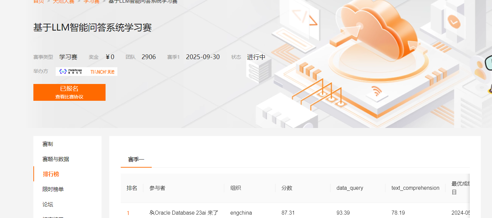

# 项目介绍
项目来自阿里天池，基于大模型的智能问答
https://tianchi.aliyun.com/competition/entrance/532172/rankingList

看了他介绍，会把优秀案例分享出来，但看了那些分享要么只给了架构图，要么代码不是基于 agent 的。
基于规则，机器学习啥的。

于是只能自己搞了一个方案试试了。

数据的话官网可以下载。

# 方案
我使用的是 glm4 的 api，agent 使用的 langchain 的框架。

主要是 RAG 跟 Agent，题目数据主要是针对这两方面的。

## 分类
RAG 的是针对招股书进行检索的问题，Agent 是针对需要对数据库查询的
问题，需要先生成 sql，再执行 sql。

所以第一步先分类，判断问题随时哪一类。招股，sql？

## RAG
对于给的招股书，文件名试试一堆乱码，我尝试过直接全部 embedding 后，根据问题检索，但发现
基本检索出来的都是最后一个文件的结果，猜测是生成的向量库太大，导致检索不准确。

于是先利用 LLM 提取每一份招股书的公司，以公司名重新命名：
[run_extract_company.py](RAG%2Frun_extract_company.py)

在输入问题后判断为‘招股’，就利用规则判断是哪一家公司的，然后直接在这份文件
直接检索，准确率效果大大的提升。

## Agent
判断为 sql，就先生成 sql，再执行 sql。
这里是问题最多的地方，一个是模型的能力相关，生成的 sql 受很大影响，
我调整了多次 prompt 及温度，生成的 sql 勉强还可以，但大多数问题是
生成 sql 有误，不符合表结构字段不存在会报错，或者可以执行，但查不出结果。

到这里就不想再调了，调太耗 token l。

# 代码入口
[run_answer.py](run_answer.py)
通过读这个可以直接明白整套逻辑。

模型api修改在：[llm_api_key.py](llm%2Fllm_api_key.py)

