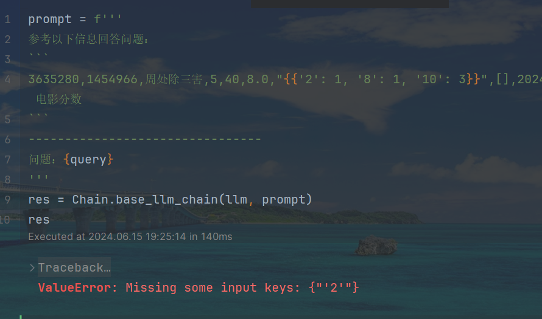
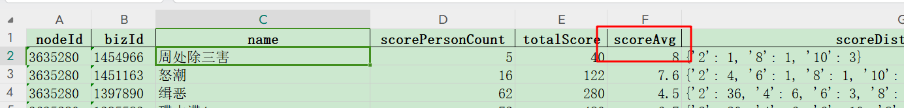
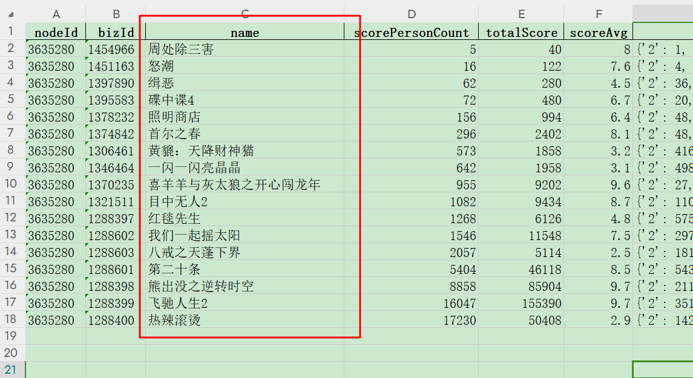

# BUG 记录
在 csv 数据中，如果某个字段的值是字典格式，那通过带变量的 prompt 传入的变量，会导致 csv 数据无法正常解析，导致报错。
例如：



# 项目介绍
使用智谱 glm4 模型，利用 langchain 检索，针对 csv 数据进行检索，通过控制检索数量，检索后过滤，让模型输出理想效果


# 周处除三害`这部电影的的平均评分是多少？
检索相似度最相关的 100 条数据，再让大模型回答：
```js
query = '`周处除三害`这部电影的的平均评分是多少？'
retriever = Retriever.similarity(db, query, topk=100)
retriever
prompt = '''
参考以下信息回答问题：
\```
{context}
\```
--------------------------------
问题：{query}
\'''
res = Chain.base_llm_chain(llm, prompt, query=query, context=retriever)
res
```
```js
'根据文档内容，电影`周处除三害`的平均评分为8.0。'
```
符合预期：



# 春节期间上映了多少部电影？
对于这个问题，其实也就是问，score.csv 有多少条数据，就说明有多少被评论了：

难点在于，要检索多少条才能把这 17 条都得到，最后使用的是把所有都检索回来后，使用 llmaindex 后过滤：
```js
query = '春节期间上映了多少部电影？电影名称的字段为`name`'
langchian_retriever = Retriever.similarity(db, query, topk=len(docs))
langchian_retriever
# 使用 llmaindex 后处理过滤
from llamaindex_module import RetriverRank


retriever = RetriverRank.langchain_retriver_convert_NodeWithScore(langchian_retriever, query)
display(len(retriever))

retriever = RetriverRank.keyword_node_postprocessor(retriever,  required_keywords=['电影分数'])
len(retriever)

prompt = '''
参考以下信息回答问题：
\```
{context}
\```
--------------------------------
问题：{query}
\'''
res = Chain.base_llm_chain(llm, prompt, query=query, context=retriever)
res
```
最后成功输出 17 部的答案：
```js
'根据提供的信息，春节期间上映了多部电影，具体电影名称如下：\n\n1. 周处除三害\n2. 怒潮\n3. 缉恶\n4. 碟中谍4\n5. 照明商店\n6. 红毯先生\n7. 喜羊羊与灰太狼之开心闯龙年\n8. 热辣滚烫\n9. 八戒之天蓬下界\n10. 首尔之春\n11. 第二十条\n12. 黄貔：天降财神猫\n13. 熊出没之逆转时空\n14. 目中无人2\n15. 一闪一闪亮晶晶\n16. 飞驰人生2\n17. 我们一起摇太阳\n\n共有17部电影在春节期间上映。'
```

# `怒潮`这部电影的评论主要讲了什么？
通过相似度过滤，大于 0.3 的检索回 100 个数据，再让大模型回答：
可能是因为这部电影的数据比较少，都检索回来了，答案也符合预期：
```js
query = '`怒潮`这部电影的评论主要讲了什么？'
langchian_retriever = Retriever.similarity_score_threshold(db, query, topk=100, score_threshold=0.3)
langchian_retriever
prompt = \'''
参考以下信息回答问题：
```
{context}
\```
\--------------------------------
问题：{query}
\'''
res = Chain.base_llm_chain(llm, prompt, query=query, context=langchian_retriever)
res
```
```
'根据提供的电影评论，关于《怒潮》的主要评论如下：\n\n1. 一位用户表示，这部电影非常棒，尤其是最后的推理部分令人惊艳。\n\n2. 另一位用户认为，《怒潮》这部电影可以打败100部《热辣滚烫》。\n\n3. 在电影评分数据中，怒潮的评分为7.6分，其中10分评价有10个，2分评价有4个。\n\n综上所述，《怒潮》这部电影受到一定的好评，尤其是结局部分的推理部分获得了较多用户的称赞。'
```